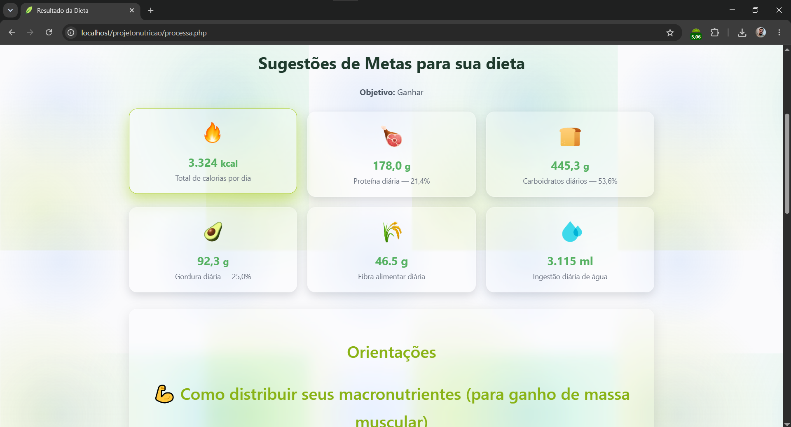
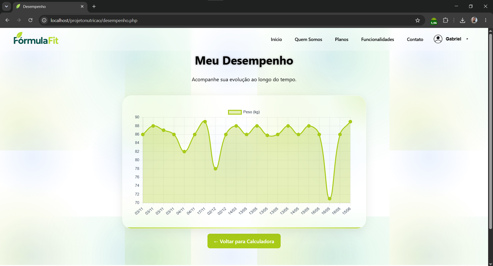

# Nutrition Calculator --- Macronutrients & Dietary Tips

A complete web application developed using PHP + MySQL to calculate the ideal amount of macronutrients (proteins, carbohydrates, and fats) according to the user's goal: lose weight, maintain weight, or gain muscle mass.

In addition, the system provides personalized guidance, performance charts, modern animations, and informational pages to assist users throughout their nutritional journey.

---

## 🌐 Live Demo

🔗 **Access the application online:**

https://nutrition-calculator-production.up.railway.app/

---

## 📷 Screenshots

### Login Screen


### Dashboard


### Macronutrient Calculation



### Performance Page



---

## 🚀 Main Features

- 🔐 **Authentication**
  - Login, registration, logout, and route protection.

- ⚖️ **Personalized nutritional calculation**
  - Uses data such as age, weight, height, gender, and goal.
  - Calculates daily calorie needs.
  - Generates macronutrient distribution (carbohydrates, proteins, and fats).
  - Displays detailed nutritional recommendations.

- 📊 **Performance Dashboard**
  - User performance tracking.
  - Interactive charts powered by Chart.js.
  - Historical visualization of records

- 🧭 **Informational pages**
  - About\
  - Features\
  - Contact\
  - Support\
  - Plans

- **Modern interface**
  - Fully responsive
  - Custom UI components
  - Smooth animations and interactions

---

## 🛠️ Technologies Used

- **PHP 7+**
- **MySQL**
- **HTML / CSS**
- **JavaScript**
- **Chart.js**
- **Custom CSS Animations**
- Railway (Deployment)

---

## How to Install and Run Locally (XAMPP)

### 🔧 Prerequisites

- XAMPP installed (Apache + MySQL)\
- Updated browser\
- Git (optional)

---

### **1️⃣ Clone the Repository**

```bash
git clone https://github.com/gabrielschwanke/projeto-nutricao.git
```

Or download the ZIP from GitHub.

---

### **2️⃣ Move to the Local Server Directory**

#### Windows:

```
C:\xampp\htdocs\calculadora-nutricional
```

#### macOS / Linux:

```
/opt/lampp/htdocs/calculadora-nutricional
```

---

### **3️⃣ Start Apache and MySQL**

Open the XAMPP control panel and start:

✔ Apache
✔ MySQL

---

### **4️⃣ Create the Database**

1. Access: http://localhost/phpmyadmin

2. Click **New**\

3. Create a database named:

   dieta_db

4. Go to **Import**\

5. Select the file:

   database.sql

6. Click **Execute**

---

### **5️⃣ Database Configuration**

The database connection file is located at:

includes/conexao.php

For local development, make sure the database name matches the one configured in the file (dieta_db).

For production environments, update the database credentials according to your hosting provider.

---

### **6️⃣ Access the Application**

Open in your browser:

```
http://localhost/calculadora-nutricional/
```

---

## 📁 Project Structure
```
calculadora-nutricional/
│
├── assets/
│   ├── css/
│   │   └── style.css
│   ├── icons/
│   └── js/
│       └── custom-select.js
│
├── includes/
│   ├── conexao.php
│   ├── footer.php
│   └── header.php
│
├── cadastro.php
├── contato.php
├── desempenho.php
├── formulario.php
├── funcionalidades.php
├── index.php
├── logout.php
├── perfil.php
├── planos.php
├── processa.php
├── registrar.php
├── resultado.php
├── sobre.php
├── suporte.php
├── validar_login.php
├── verifica_login.php
│
├── .gitignore
├── database.sql
├── Dockerfile
└── README.md

```

---

## 👨‍💻 Author

Gabriel Pereira Schwanke

Frontend Developer | Systems Analysis and Development Student